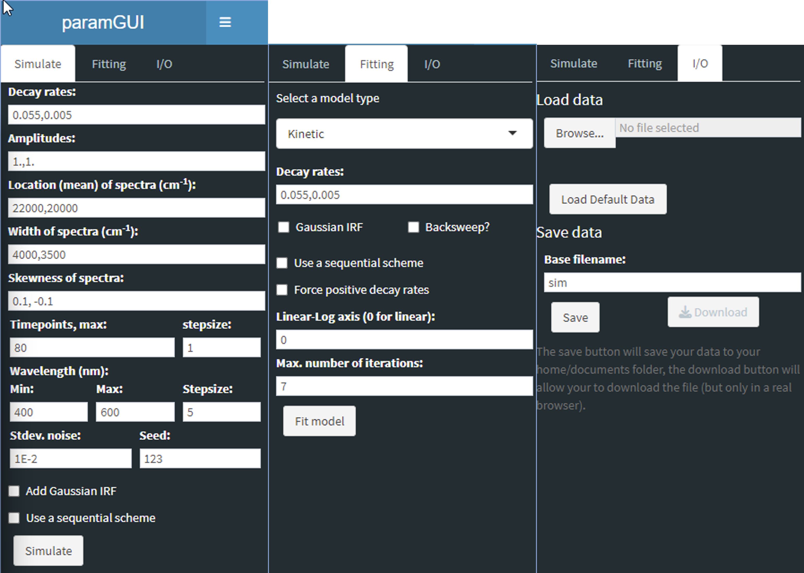
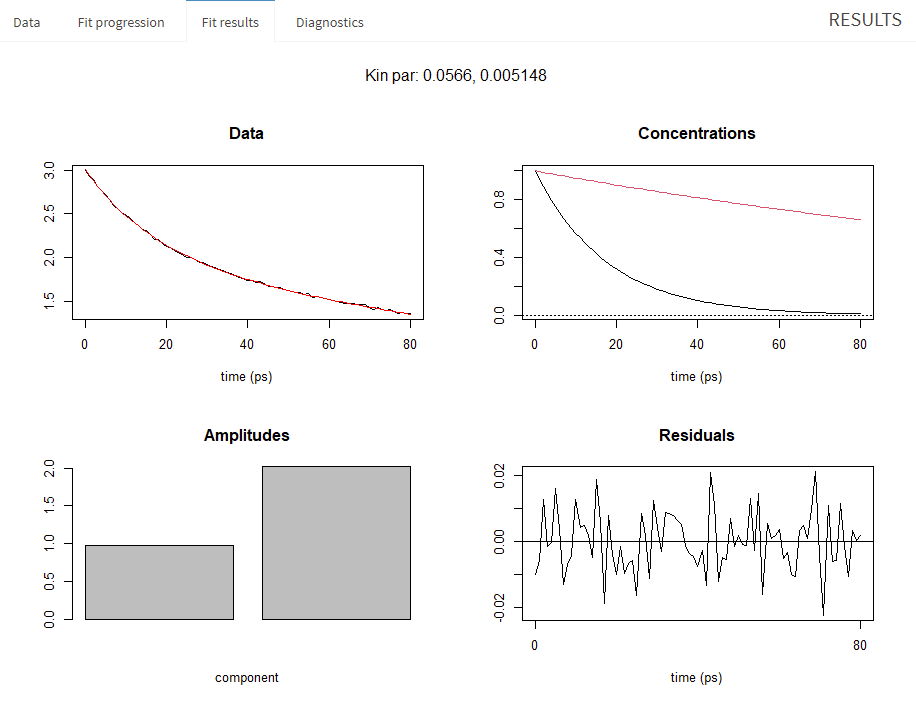

# Background information on: paramGUI

This readme provides some additional information about the application used for pyglotaran cross-validation, how it works and how it was used to generate validation-data.

## What is it?

paramGUI is an R-package for teaching parameter estimation examples inspired by time-resolved spectroscopy. It is based on the Shiny framework and consists of an interactive graphical user interface (GUI) that can be used to explore various parameter estimation examples.

## How does it work?

In the GUI users can simulate data while controlling a limited number of variables (Simulate), model and fit data (Fitting), as well as load and save data (I/O).



The main window features 4 primary tabs to explore data (Data), visualize the optimization process (Fit progression), visualize the optimization results (Fit results) and explore the statistical significance of the fitted results (Diagnostics).

### Data

, 1st LSV data, 1st RSV data")

The first of those tabs (Data) typically shows 4 plots. From left to right, the first of those plots, labeled `Data`, shows a 2D intensity map of the (simulated) dataset, with time on the horizontal axis, and wavelength on the vertical axis. The second plot, labeled `log(sing val. data)` shows a logarithmic plot of the singular values of the Singular Value Decomposition (SVD). The third plot, labeled `1st LSV data`, shows the first left singular vector of the SVD of the Data, which depicts the magnitude along the time axis. And finally the fourth plot, labeled `1st RSV data`, shows the first right singular vector of the SVD of the data, which depicts the magnitude along the spectral axis.

In the case that a single wavelength has been simulated, for instance by setting Min==Max or using a stepsize larger than the selected wavelength interval, a single trace is plotted, and the SVD plots are omitted.

### Fit progression

The tab Fit progression shows the raw output of the minimizer. On each iteration it prints the residual,

```console
0.3201847   (3.32e-03): par = (0.055 0.005)
  It.   1, fac=           1, eval (no.,total): ( 1,  1): new dev = 0.320181
0.3201812   (6.33e-06): par = (0.05503539 0.00500788)
```

### Fit results

The tab Fit results shows an results overview plot showing both the data, the SVD of the data, the fitted traces (concentrations) and estimated spectra, as well as the Residuals, and the SVD of the Residuals.

, 1st LSV data, 1st RSV data, Concentrations, Spectra, 2nd LSV data, 2nd RSV data, Residuals, log(sing val. resid.), 1st LSV resid., 1st RSV resid.")

In the case of a single trace, only the Data, Concentrations, Amplitudes and Residuals are shown.



### Diagnostics

The diagnostics tab shows the statistics output as returns by the call to the non-linear least squares (nls) fitting function.

```console

Formula: 0 ~ rescomp(theta = t, d = d, currModel = currModel)

Parameters:
    Estimate Std. Error t value Pr(>|t|)
t1 5.504e-02  2.263e-04   243.2   <2e-16 ***
t2 5.008e-03  4.465e-05   112.2   <2e-16 ***
---
Signif. codes:  0 ‘***’ 0.001 ‘**’ 0.01 ‘*’ 0.05 ‘.’ 0.1 ‘ ’ 1

Residual standard error: 0.009945 on 3237 degrees of freedom
Number of nonlinear parameters: 2
Number of conditionally linear parameters: 82

Correlation of Parameter Estimates:
   t1
t2 0.58

Number of iterations to convergence: 1
Achieved convergence tolerance: 6.328e-06
```

## How was it used to generate validation data?

The default example which a paramGUI session starts with consists of

### Validation set 01

Using the default parameters of paramGUI.

### Validation set 02

### Validation set 03

### Validation set 04
